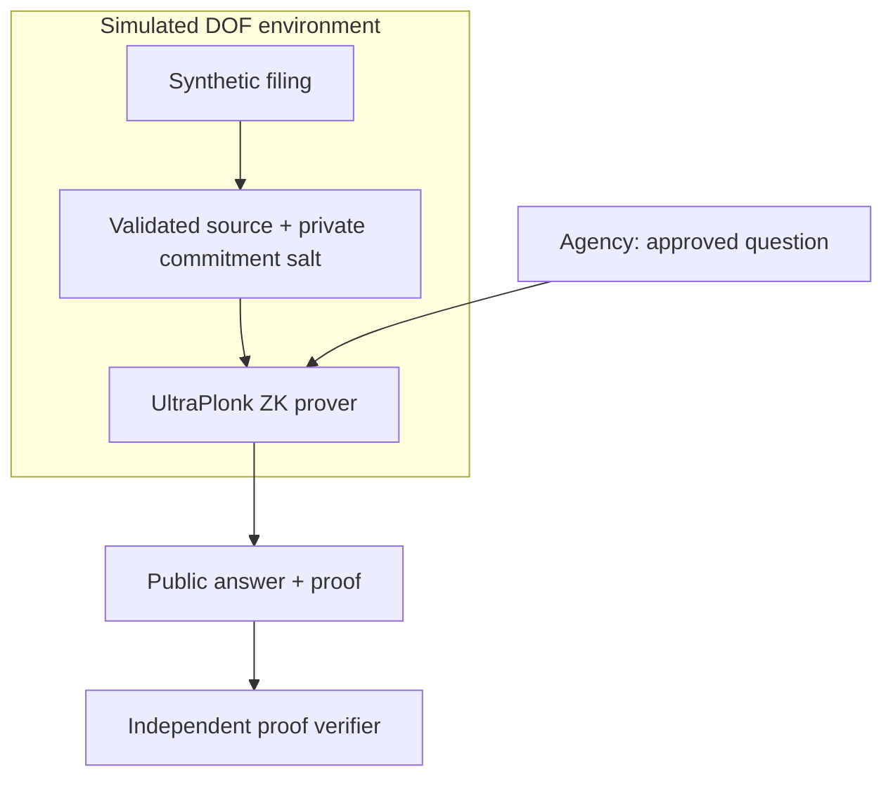

<div align="center">


[](https://github.com/Redoudou/housingproof/actions/workflows/checks.yml)

[](LICENSE)

**[Project site](https://redoudou.github.io/housingproof/) · [Quick start](#quick-start) · [MVP plan](docs/mvp-plan.md) · [Release notes](docs/releases/v0.2.0-alpha.1.md) · [Releases](https://github.com/Redoudou/housingproof/releases)**

</div>

## The idea

**What if a housing agency could ask a confidential filing a question—without receiving the filing?**

Housingproof explores that model using New York City's RPIE income-and-expense reports. DOF would retain the protected record. An authorized agency would ask a narrow, approved question and independently verify the answer.

> **Keep the data private. Unlock the answers.**

The first question is deliberately simple:

**“Does this filing report at least 20 rent-regulated residential units?”**

The potential outcome: better evidence for housing decisions, with controlled disclosures instead of copies of confidential records.

## What you can try today

| Capability | Status |
|---|---|
| Synthetic building filings for 2024 and 2025 | Available |
| Source-mapped schema and exact question definitions | Available |
| Input validation and signed simulator source receipts | Available |
| Local custodian / agency interface | Available |
| Genuine Q001 YES / NO proofs and independent verification | Available |
| Q002 cross-year proof with strict boundary checks | Available |

**Synthetic inputs. Real zero-knowledge proofs.** The local app generates fresh UltraPlonk proofs, verifies the signed source and approved statement, and then releases YES or NO. Export the public bundle and verify it without the source records or issuer private key. A signed receipt alone is never accepted as a verified answer.

The linked project site presents the concept and current status. It is **not a hosted prover**. Its deployment is managed by the [Pages workflow](.github/workflows/pages.yml); the URL becomes available after its first successful deployment.

## Quick start

Requires **Node.js 22+** and **Python 3**.

```bash
git clone https://github.com/Redoudou/housingproof.git
cd housingproof
npm ci
npm run zk:build
npm run check
npm test
npm run dev
```

Open **http://localhost:3000**.

1. Register the baseline 2025 source in the DOF simulation.
2. Ask Q001 and see a genuine, verified YES. Try the below-count source for NO.
3. Select Q002, register the 2024 source, and query the stress variant for YES. Exactly 20% decline returns NO.
4. Export and re-import the public bundle. Use **Test a changed answer** to watch verification reject it.
5. For separate verification, obtain the simulator's public issuer key from a trusted operator and run `npm run verify -- answer-bundle.json trusted-issuer-public.pem`.

The first build downloads the backend's public CRS and checks compiled circuit and verification-key fingerprints. It requires internet access. Proof operations use isolated, single-threaded workers with a three-minute timeout. See [proof protocol](docs/proof-protocol.md) and [validation evidence](docs/mvp-validation.md).

Both panels share one local simulation. They illustrate roles, not production authentication or network isolation.

## One building. Two years. Clear boundaries.

The dataset contains one fictional 40-apartment property, synthetic 2024/2025 records, and boundary, stress, invalid, and incomplete variants. It contains no real addresses, taxpayer identifiers, or tenant identities.

- **Q001:** reported regulated units ≥ 20. The local arithmetic cases cover 24 → YES, 20 → YES, and 19 → NO.
- **Q002:** calculated reported operating balance declines by **more than** 20%. Exactly 20% is NO. A missing or nonpositive prior balance is UNAVAILABLE.

The fixture oracle checks arithmetic; the separate ZK suite generates and verifies real proofs for these cases. The [internal schema](data/schema.json) follows a narrow subset of the [official RPIE-2025 worksheet](https://www.nyc.gov/assets/finance/downloads/pdf/rpie/rpie-worksheet.pdf); it is not an official DOF interchange format. [Read the mapping](docs/rpie-schema.md).

## Under the hood



The host and Noir circuits share one fixed-order salted Poseidon2 encoding. Public inputs bind the source commitments and metadata, catalog identity, fixed parameters, and Boolean answer. The verifier accepts only locally pinned circuits and verification keys. [Read the protocol](docs/proof-protocol.md).

## Find your way around

| Path | Purpose |
|---|---|
| [`docs/mvp-plan.md`](docs/mvp-plan.md) | Product scope, trust model, and build gates |
| [`data/`](data/) | Synthetic sources, schema, and fixed question catalog |
| [`server/`](server/) | Local custodian service; private runtime keys are ignored |
| [`src/`](src/) | Validation, receipts, and verification boundaries |
| [`circuits/`](circuits/) | Q001 / Q002 circuits, shared projection hash, and pinned trust |
| [`public/`](public/) | Local demonstration interface |
| [`site/`](site/) | Static project presentation for GitHub Pages |
| [`docs/releases/`](docs/releases/) | Versioned release notes |

## Checks

```bash
npm run check    # TypeScript + fixture validation
npm test         # Fast input, policy, signature and failure-path tests
npm run test:zk  # Genuine proofs, circuit constraints, tampering and isolated CLI
# Optional browser checks: install Chromium first
npx playwright install chromium
npm run test:browser
npm run demo     # Local arithmetic oracle; no cryptography
npm run verify -- answer-bundle.json trusted-issuer-public.pem
```

The verifier uses an operator-supplied issuer public key and pinned circuit keys. CI runs actual cryptographic tests as well as application checks. Private witness values are supplied to the worker on stdin and never written to shared proof files.

## What comes after the MVP

This is a local synthetic demonstration. A pilot needs independent access control, approved recipients, persistent source/disclosure storage, source revision and revocation rules, operational keys, and a reviewed ingestion map. The circuit and application have not undergone an independent security audit. The Pages site is a project overview; it does not host the Express application.

A proof would establish computation against reported data, not the accuracy of an owner's declaration. Real inputs, recipients, and derived disclosures would require City authorization and review.

---

[Apache 2.0](LICENSE) · Independent prototype; no NYC or DOF endorsement is implied.
