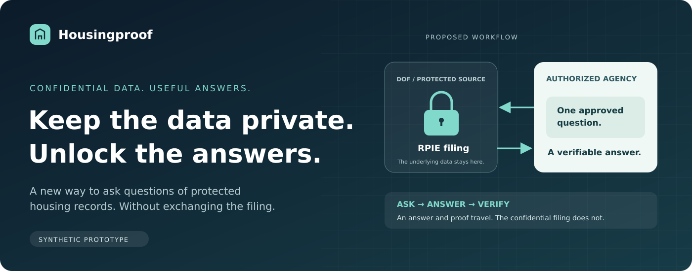
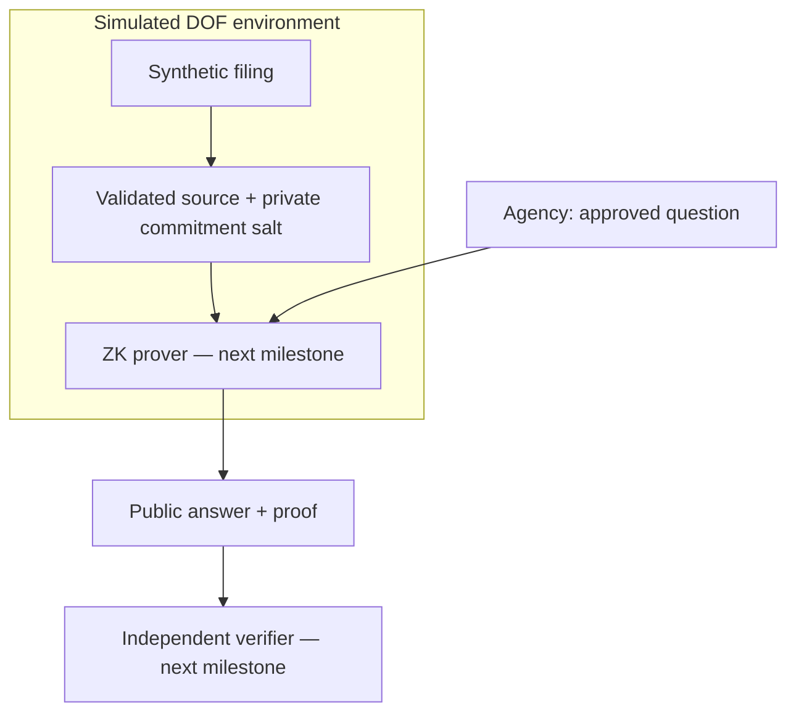

<div align="center">



[](https://github.com/Redoudou/housingproof/actions/workflows/checks.yml)

[](LICENSE)

**[Project site](https://helloredwan.me/housingproof/) · [Quick start](#quick-start) · [DOF pilot workflow](docs/dof-pilot.md) · [MVP plan](docs/mvp-plan.md) · [Release notes](docs/releases/v0.1.0-alpha.1.md) · [Releases](https://github.com/Redoudou/housingproof/releases)**

</div>

## The idea

**What if a housing agency could ask a confidential filing a question—without receiving the filing?**

Housingproof explores that model using New York City's RPIE income-and-expense reports. DOF would retain the protected record. An authorized agency would ask a narrow, approved question and independently verify the answer.

> **Keep the data private. Unlock the answers.**

The first question is deliberately simple:

**“Does this filing report at least 20 rent-regulated residential units?”**

The potential outcome: better evidence for housing decisions, with controlled disclosures instead of copies of confidential records.

## What you can try today

| Capability | Status |
|---|---|
| Synthetic building filings for 2024 and 2025 | Available |
| Source-mapped schema and exact question definitions | Available |
| Input validation and signed simulator source receipts | Available |
| Local custodian / agency interface | Available |
| Genuine Q001 ZK proof and independent verification | **Next milestone** |
| Cross-year operating-balance proof | Planned |

**This is a synthetic prototype. It does not yet produce a ZK-verified answer.** The local UI reports proof generation as unavailable and withholds YES/NO and bundle export. A signed source receipt authenticates the simulated source; it does not verify an answer.

The linked project site presents the concept and current status. It is **not a hosted prover**. Its deployment is managed by the [Pages workflow](.github/workflows/pages.yml); the project overview is deployed at [helloredwan.me/housingproof](https://helloredwan.me/housingproof/).

## Quick start

Requires **Node.js 22+** and **Python 3**.

```bash
git clone https://github.com/Redoudou/housingproof.git
cd housingproof
npm ci
npm run check
npm test
npm run dev
```

Open **http://localhost:3000**.

1. Select a fictional filing and register it in the DOF simulation.
2. Inspect its signed source receipt. Incomplete or invalid records are rejected.
3. Ask the approved question. Until the real proof milestone is complete, the agency view explains that no verified answer is available.

Both panels share one local simulation. They illustrate roles, not production authentication or network isolation.

## A proposed Department of Finance pilot

DOF could audit and run this Apache-2.0 code in its own environment, then evaluate a controlled sample of about 100 filings. Start with synthetic records; use authorized real samples only inside the DOF environment after the required review. The current app has no bulk importer and does not yet generate genuine proofs.

The proposed flow is **import → validate → register → ask an approved question → generate a proof inside DOF → verify outside the source environment**. DOF retains source access. The authorized recipient receives only the approved answer, permitted public metadata, and proof—not the filing or hidden input values. The answer itself discloses information; proofs do not authorize disclosure or establish that the owner's report is true.

[Read the pilot walkthrough, access boundaries, and acceptance checklist](docs/dof-pilot.md).

## One building. Two years. Clear boundaries.

The dataset contains one fictional 40-apartment property, synthetic 2024/2025 records, and boundary, stress, invalid, and incomplete variants. It contains no real addresses, taxpayer identifiers, or tenant identities.

- **Q001:** reported regulated units ≥ 20. The local arithmetic cases cover 24 → YES, 20 → YES, and 19 → NO.
- **Q002, planned:** calculated reported operating balance declines by **more than** 20%. Exactly 20% is NO. A missing or nonpositive prior balance is UNAVAILABLE.

These are fixture calculations, **not cryptographic proofs**. The [internal schema](data/schema.json) follows a narrow subset of the [official RPIE-2025 worksheet](https://www.nyc.gov/assets/finance/downloads/pdf/rpie/rpie-worksheet.pdf); it is not an official DOF interchange format. [Read the mapping](docs/rpie-schema.md).

## Under the hood



The diagram shows the target flow. The prover/verifier path is intentionally disabled until the circuit, source commitment, public inputs, and trusted verification key agree and pass genuine proof tests. [Implementation review](docs/implementation-review.md).

## Find your way around

| Path | Purpose |
|---|---|
| [`docs/mvp-plan.md`](docs/mvp-plan.md) | Product scope, trust model, and build gates |
| [`data/`](data/) | Synthetic sources, schema, and fixed question catalog |
| [`server/`](server/) | Local custodian service; private runtime keys are ignored |
| [`src/`](src/) | Validation, receipts, and verification boundaries |
| [`circuits/`](circuits/) | Disabled legacy Noir placeholder awaiting replacement |
| [`public/`](public/) | Local demonstration interface |
| [`site/`](site/) | Static project presentation for GitHub Pages |
| [`docs/releases/`](docs/releases/) | Versioned release notes |

## Checks

```bash
npm run check    # TypeScript + fixture validation
npm test         # Input, policy, receipt, API, and verification-boundary tests
npm run demo     # Local arithmetic oracle; no cryptography
npm run verify -- answer-bundle.json trusted-issuer-public.pem
```

The verifier uses a separately supplied public trust anchor. It fails closed while ZK verification is unavailable. Application tests do not establish that a circuit or proof works.

## Next: the first real proof

Implement a shared commitment encoding and fixed-Q001 circuit, pin compatible Noir/Barretenberg versions and a trusted verification key, then demonstrate genuine YES and NO proofs. Reject altered answers and mismatched sources. Verify an exported bundle without the private filing. **Only then enable the verified-answer experience.**

A proof would establish computation against reported data, not the accuracy of an owner's declaration. Real inputs, recipients, and derived disclosures would require City authorization and review.

---

[Apache 2.0](LICENSE) · Independent prototype; no NYC or DOF endorsement is implied.
