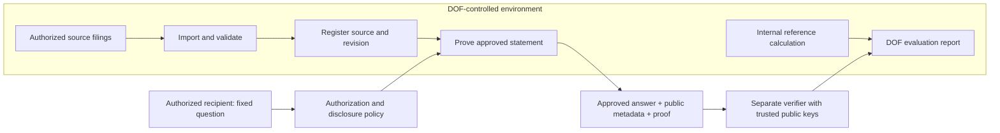

# A small Department of Finance pilot

Proposal, October 7, 2026. This is an evaluation workflow, not a claim of production readiness or City endorsement. The existing MVP build plan remains authoritative for cryptographic milestones.

## What the trial should demonstrate

**DOF keeps the filing. An authorized recipient gets an approved answer and checks its proof without receiving the filing.**

DOF can inspect, modify, and run the Apache-2.0 source in an environment it controls. A first trial should use about 100 synthetic filings with known expected outcomes. A subsequent trial could use about 100 authorized RPIE samples inside DOF after review of source access and derived disclosures. No real sample should be uploaded to GitHub, the public project site, or a maintainer's machine.

The public deployment is a project overview. The current local application validates the bundled synthetic records and issues signed simulator receipts. It generates genuine UltraPlonk proofs for Q001 and Q002 and exports public bundles that verify without the source records. It has no file-upload or bulk-import workflow and no production identity separation. It releases no answer when proving or verification fails. A receipt alone is not proof of an answer.

## Make the first visit simple

The proposed entry screen has three steps: **Load a sample → Ask a question → Check the evidence**. Offer “Try 100 synthetic filings” first. Keep real-source import in the custodian-only view. A visible status label must distinguish local arithmetic, source receipt validation, and genuine proof verification.

| Step | Reviewer action | What the product should show | Implementation status |
|---|---|---|---|
| Run | Audit a pinned release, install dependencies, start locally | Local address and an explicit synthetic-mode banner | Current Node/Python quick start exists; no turnkey offline installer |
| Import | Load a batch in the DOF view | Accepted/rejected totals and row-specific validation reasons | Proposed bulk importer and sample generator |
| Register | Confirm validated sources | Period, source revision, and source receipt | Existing per-fixture registration; batch handling and persistence needed |
| Ask | Choose a source and fixed Q001 | The exact approved question; no arbitrary threshold field | Existing question path; role authorization needed |
| Prove | Request an answer | Pending state, then a verified YES/NO only after successful proof checking | Existing for Q001/Q002 on synthetic records; batch proving needed |
| Check | Open the public bundle on a separate verifier | Answer, question/version, permitted source metadata, and individual check results | Existing standalone CLI verifier with operator-supplied issuer key |
| Compare | Compare with DOF's internal reference calculation | Agreement, failures, timings, and disclosure audit | Proposed evaluation report |

Use the README quick start today. It installs dependencies from the network; “local runtime” does not mean an air-gapped installation. An offline package would need reviewed, pinned dependencies and prover artifacts. Do not substitute real data into the shared simulation and call it a protected deployment.

## Prepare the 100-record sample

Build a reproducible synthetic batch covering counts below, at, and above 20, plus missing fields, invalid amounts, duplicate source IDs, and revised filings. Keep a separate expected-outcomes file for DOF reviewers. Report invalid inputs separately from valid YES/NO outcomes; do not count them as NO. Record the random seed, application commit, schema version, and question version.

For real samples, implement and review an adapter from the actual DOF export into the narrow canonical schema. The repository's JSON is not an official RPIE import format. Start with a documented JSON batch contract and add CSV only when the source mapping is known. Validate each record before registration; reject unsupported fields/structures or incomplete projections with useful errors. Specify duplicate and revision behavior and reconcile imported totals with the selected source population. Keep original-to-normalized mapping records inside DOF for audit.

A hundred records tests a workflow, not citywide coverage or representativeness. Q001 is per filing; it does not prove a population is complete. Q002 remains a later milestone.

## Who sees what

| Participant | May hold or receive | Must stay outside their answer bundle |
|---|---|---|
| DOF custodian | Authorized originals, normalized inputs, private commitment salts, signing keys, internal expected answers and audit mapping | Private material must remain in the DOF environment |
| Authorized requesting agency | Approved Boolean, allowed property/period/revision metadata, signed source manifest, proof and circuit identity | Original filing, exact hidden counts, income/expense lines, salts, signing key |
| Independent verifier | The same public bundle plus separately trusted issuer and circuit verification keys | Original source data and private proving inputs |
| Project maintainers/public site | Open source and synthetic demonstrations | Real filings, real answer bundles, runtime keys and private logs |

“Recipient has no access to the data” means **no access to the underlying filing through this workflow**. DOF retains source access. The recipient learns the answer and public metadata, which are themselves disclosures. Repeated or linked questions can reveal more; a proof does not make outputs information-free. The current shared UI does not enforce these boundaries.

This is the target architecture. Authentication, a separate recipient service, private storage, disclosure logging, and cryptographic implementation are build requirements. For a first isolated test, run the verifier on another machine that has no copy of the input sample. Keep proving inside DOF; no external AI service needs the filings.

## Questions versus chat

Start with a dropdown and the exact Q001 wording: “Does this filing report at least 20 rent-regulated residential units?” A later natural-language interface may map a request to a versioned, approved predicate and ask the reviewer to confirm that interpretation. It must refuse unsupported questions and must not send raw filings to a language model. Free-form chat cannot manufacture a proof for an unimplemented question.

A YES means the committed filing reports at least 20 such units. It does not establish legal regulation status or the truth of the owner's declaration. The signed manifest establishes issuer provenance; the genuine ZK proof establishes the computation on the committed projection. Trusted normalization links that projection to the source outside the circuit.

## Acceptance checklist

Before calling this an end-to-end proof pilot:

- Generate fresh genuine Q001 YES and NO proofs, including the 19/20 boundary, and verify with separately trusted issuer and circuit keys.
- Compare every accepted synthetic record with the independently prepared expected result; show import rejection counts separately.
- Reject altered answers, mismatched periods/revisions/commitments, untrusted issuer keys, invalid proofs, and unsupported predicates. Release no answer on a proving or verification failure.
- Verify an exported bundle on a machine without the filing, salts, or issuer private key.
- Inspect recipient responses, downloads, browser traffic, errors, and logs for raw source or witness leakage. Check dependency/runtime network traffic before claiming local-only operation.
- Enforce distinct custodian/requester permissions; test that recipients cannot import, browse private records, retrieve keys, or bypass the question catalog. Review which public identifiers may be released.
- Record machine specifications, per-proof and batch timing, peak memory, proof size, failures, and reproducibility. Set acceptable performance targets with reviewers before the trial.
- Test restart, revision, retention, and deletion behavior; document how old proofs refer to old revisions. A valid proof alone does not establish that a source is the latest filing.

The reviewer handoff should include a pinned source release, reproducible synthetic sample, deployment instructions, data-flow diagram, known limitations, reference results, verification instructions, and completed test report. Separate “workflow demonstrated” from “cryptographic verification passed.”

## Suggested build order

1. Done in v0.2.0-alpha.1: genuine Q001/Q002 proofs and independent verification (see [MVP validation](mvp-validation.md)).
2. Add the reproducible 100-record synthetic sample, validated batch importer, and comparison report.
3. Separate custodian and recipient access, implement private persistence and policy/audit controls, and package a repeatable local evaluation.
4. Have DOF review the adapter, environment, authorized recipients/questions, and derived disclosures before any real-sample trial.

The first useful demonstration is one valid YES, one valid NO, one invalid source, and one tampered proof. Then run the same flow over the batch. This gives reviewers an observable success and failure path without implying arbitrary questions or production readiness.
